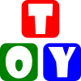

  <article style="display: flex; flex-direction: column; align-items: center; justify-content: center;">
      
      <h1 style="width: 100%; text-align: center;">ToyCV</h1>
  </article>

ToyCV是一个玩具图像软件库，只能进行简单的图像处理。主要是在学习C++和CMake的过程中进行实际练习的小项目。该图标使用开源矢量绘图软件[Inkscape](https://gitlab.com/inkscape/inkscape)绘制。

